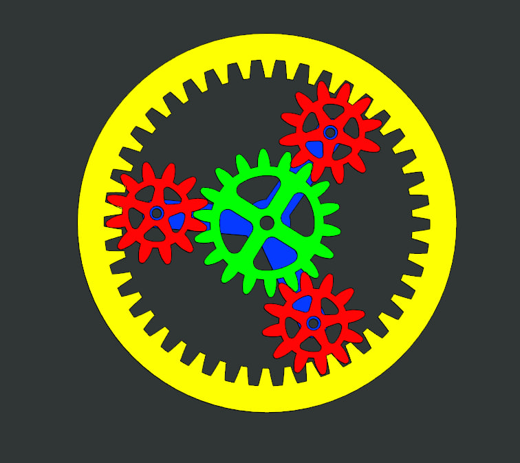
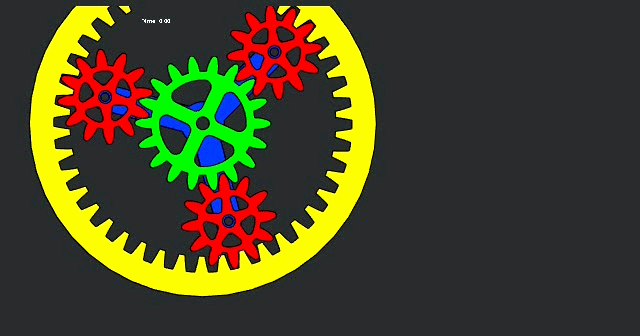

## Simple Spur Gear Train Mechanism

  

### Overview

This project demonstrates the modeling and kinematic simulation of a simple spur gear train. The objective was to simulate rotational motion transfer between multiple gears and verify the theoretical gear ratio through kinematic analysis. The system consists of a central sun gear driving two external planet gears while meshing with a stationary internal ring gear. A constant angular velocity motor was applied to the sun gear, allowing observation of velocity relationships throughout the mechanism.

This project highlights CAD assembly modeling, gear constraint definition, and motion analysis used to simulate mechanical power transmission systems.

---

### CAD Software

PTC Creo Parametric  
Creo Mechanism

---

### Assembly Components

| Component | Description |
|----------|-------------|
| Sun Gear | Input gear driven by motor |
| Planet Gears | Rotating follower gears transmitting motion |
| Ring Gear | Stationary internal gear |
| Carrier Arm | Supports rotating planet gears |

---

### Mechanical Relationships

External spur gear pairs rotate in opposite directions and follow the gear velocity relationship:

ω₁ N₁ = ω₂ N₂

Where:

ω = angular velocity  
N = number of gear teeth

The output velocity of the follower gear is therefore:

ω₂ = − ω₁ (N₁ / N₂)

The negative sign indicates opposite rotation direction.

---

### Example Gear Ratio Verification

Sun Gear Teeth: 15  
Planet Gear Teeth: 28  

If the sun gear rotates at:

ω₁ = 100 deg/sec

The theoretical follower velocity becomes:

ω₂ = −100 × (15 / 28)

ω₂ ≈ −53.6 deg/sec

The simulation produced a velocity of approximately:

−53.8 deg/sec

This confirms the correct gear constraint definition and motion relationship within the mechanism model.

---

### Simulation Method

1. Pin joints were applied to allow rotation of each gear about its shaft axis.
2. Spur gear constraints were applied between gear pairs.
3. A constant velocity servomotor was applied to the sun gear.
4. Kinematic analysis was performed to track angular velocity over time.

---

### Results

The simulation shows:

• constant angular velocity transmission  
• opposite rotation direction between meshing gears  
• stable gear ratio throughout the simulation period  

The velocity vs time plot confirms the expected mechanical behavior of the system.

---

### Velocity Plot

---

### Assembly Visualization

#### Spur Gear Train Exploded View

#### Mechanism Motion

---

### Skills Demonstrated

- Parametric CAD modeling
- Mechanical assemblies
- Gear constraint definition
- Mechanism simulation
- Kinematic analysis
- Motion visualization

---

### Application Relevance

This project demonstrates the creation and validation of mechanical digital assets suitable for simulation and AI-assisted CAD workflows. The assembly includes properly constrained geometry, parametric relationships, and motion analysis results that can be used to train or evaluate CAD models for mechanical reasoning tasks.

### Files Included
